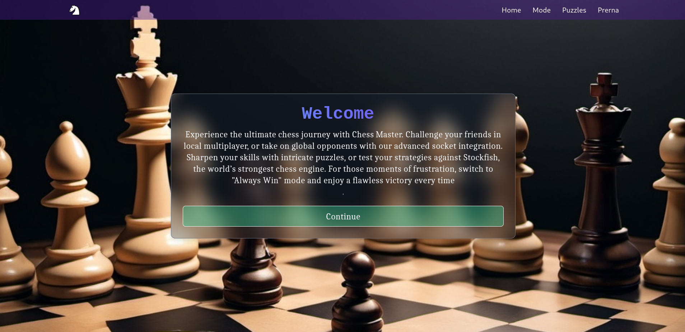
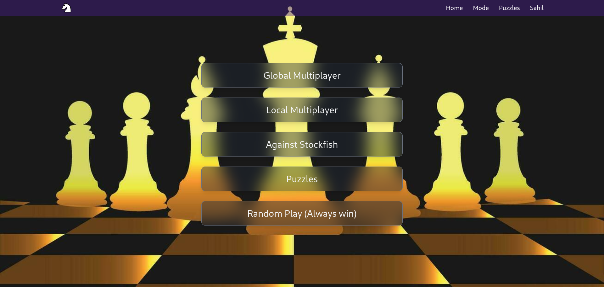
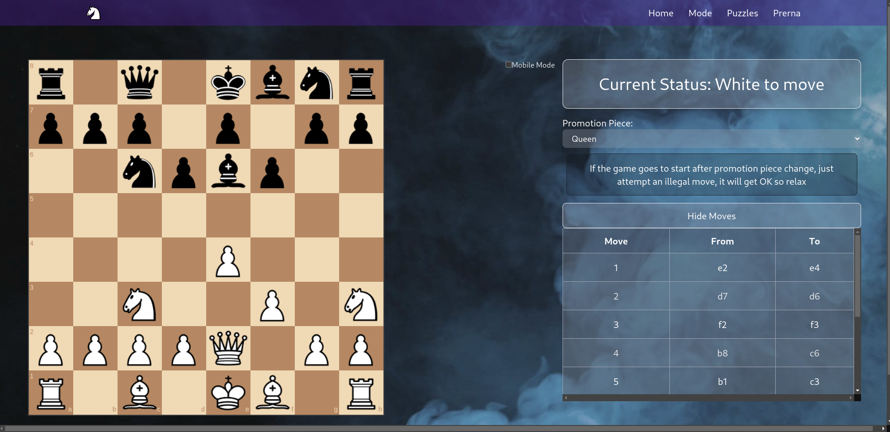
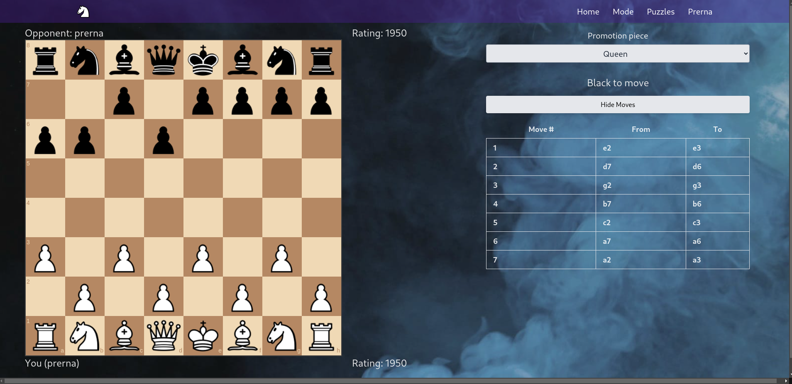
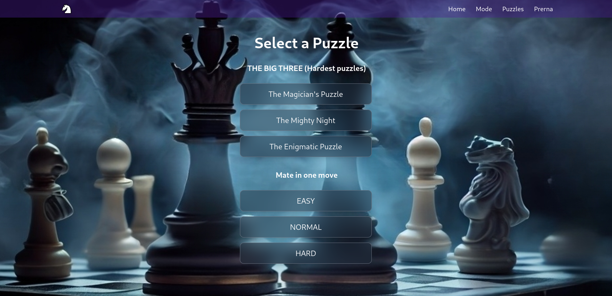

# React Chess

[](https://reactchess.onrender.com/)
[](https://github.com/contributorsambhav/ReactChess/blob/main/LICENSE)

## Overview

React Chess is a comprehensive chess application developed using the MERN stack (MongoDB, Express, React, Node.js). This project showcases full-stack development skills and modern web technologies to create an engaging and interactive chess platform.

### Live Demo
Check out the live application: [React Chess](https://reactchess.onrender.com/)

### GitHub Repository
Explore the code: [GitHub - contributorsambhav/ReactChess](https://github.com/contributorsambhav/ReactChess)

---

## Key Features

- **User Authentication and Authorization**
  - Secure authentication using Redux for state management.
  - Backend endpoint for verifying user credentials and managing sessions.

- **Homepage**
  - Visually appealing design with a transparent panel (30% opacity).
  - Typewriter effect for dynamic text display.
  - 3D-styled login and signup buttons.

- **Puzzle Components**
  - Interactive chess puzzles (Puzzle1, Puzzle2, Puzzle3) with specific FEN positions.
  - Descriptions and instructional video links to enhance user engagement and learning.

- **Local Multiplayer**
  - Seamless experience for two players on the same device.
  - Manages game states, move histories, and piece promotions.
  - Visual highlights for potential moves and captures.
  - Responsive design using Tailwind CSS.

- **Global Multiplayer**
  - Play against opponents globally.
  - Real-time game updates through socket communication.
  - Consistent game state across clients.

---

## Technical Implementation

### Frontend

- **React**
  - Utilizes components for interactive and dynamic interfaces.
  - Responsive design ensuring usability across various devices.

### Backend

- **Express.js**
  - Handles API requests, user authentication, and game state management.

- **MongoDB**
  - Robust data storage for user profiles, game histories, and configurations.

### Real-Time Features

- **WebSockets**
  - Enables real-time communication in multiplayer mode.
  - Ensures an engaging and competitive experience.

---

## Screenshots

### Homepage


### Mode Selector


### Local Multiplayer


### Global Multiplayer


### Chess Puzzle


---

## Installation and Setup

1. **Clone the repository**
   ```bash
   git clone https://github.com/contributorsambhav/ReactChess.git
   cd ReactChess
   ```

2. **Install dependencies**
   ```bash
   npm install
   ```

3. **Set up environment variables**
   - Create a `.env` file in the root directory and add the following:
     ```
     URL="https://stockfish.online/api/s/v2.php";
     JWT_SECRET=your_jwt_secret
     PORT=your_port
     ```

4. **Run the application**
   ```bash
   npm start
   ```

5. **Navigate to**
   ```
   http://localhost:3000
   ```

---

## Contributing

We welcome contributions to enhance the features and improve the codebase. To contribute:

1. Fork the repository.
2. Create a new branch (`git checkout -b feature-branch`).
3. Make your changes.
4. Commit your changes (`git commit -m 'Add some feature'`).
5. Push to the branch (`git push origin feature-branch`).
6. Open a pull request.

---


## Contact

- **Author**: Sambhav 
- **Email**: [sambhav511974@gmail.com](mailto:sambhav511974@gmail.com)
- **LinkedIn**: [Sambhav]([https://www.linkedin.com/in/sambhavjain/](https://www.linkedin.com/in/sambhav-2535a8285/))

Feel free to reach out for any queries or collaboration opportunities!

---
